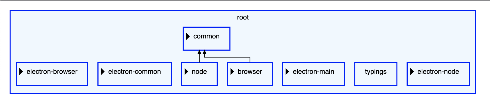

# Sprotty-nested-demo

This is a demo project using [Eclipse Sprotty](https://github.com/eclipse-sprotty/sprotty) to visualize a hierarchical graph. The dataset used represents a folder and files hierarchy in a medium-size open source project, [Eclipse Theia](https://github.com/eclipse-theia/theia/tree/master/packages/core), more specifically its `core` package.

The dataset is generated beforehand and a preprocessing step is applied to only add visible nodes and edges to the final diagram.

## Running the demo

1. install dependencies:

    ```bash
    npm install
    ```

2. build the project:

    ```bash
    npm run build
    ```

3. open `index.html` in a browser. The file is located in `./static`.

You should see this diagram:



Rectangles with a blue outline represent folders, while rectangles with a chocolate outline represent files. You can expand single nodes by clicking on the triangular button located in the top left corner of each expandable node.

Alternatively, you can expand and collapse all nodes at once by clicking the `Expand All` and `Collapse All` buttons located in the top right corner of the page. The `Fit to Screen` button will change the panning and zoom level of the diagram so that it is fully visible in the viewport.

## Generate your own dataset

1. To generate your own dataset, you need to change a variable (line 9) in `./scripts/generateData.ts`

    ```typescript
        const root = 'absolute path to the repository';
    ```

2. Then, run the:

    ```bash
        npm run generate-data
    ```

    This will replace the `./src/data.json` file with a new one, containing the new dataset.

3. Build the project:

    ```bash
        npm run build
    ```

4. Open `index.html` in a browser. The file is located in `./static`.
